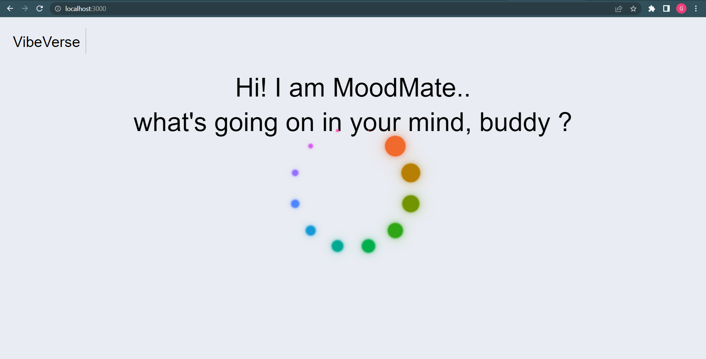

# VibeVerse
Sentiment Analyzer and Playlists Recommender built using Next.js framework.

# Live Demo
VibeVerse(https://vibe-verse.vercel.app/)

## Description
By leveraging sentiment analysis, VibeVerse brings personalized music recommendations to a whole new level. With VibeVerse, users can express themselves freely, and the app will analyze their text to understand their mood accurately.

The purpose of Moodify is to provide users with an enhanced music experience that resonates with their every emotional moment. More importanly, it can serve as a therapeutic outlet, enabling users to gain a deeper understanding of their emotional state.
Whether users are feeling happy, angry, frustrated, sad, energized, or reflective, Moodify ensures they find the perfect soundtrack to match their mood.

Go on, pour your heart out, write about how your day went, or whatever you are feeling, and it will detect your emotions accurately, even if you don't have a word for your emotion.

Remember, Life is Music & Music is Life.

## Tech/framework used and Pre-requisites
* Next.js
* MaterialUI
* Tailwind CSS
* CHATGPT API
* Spotify API

## Installation
1. Download Repository
2. Install necessary modules and packages for backend and frontend files.
   ```
   (root)/> npm install
   ```
3. **Plug in your CHATGPT API key and SPOTIFY API Keys** 
4. Run the application
   ``` 
   (root)/> npm run dev
   ```

## Getting Started

First, run the development server:

```bash
npm run dev
# or
yarn dev
# or
pnpm dev
```

Open [http://localhost:3000](http://localhost:3000) with your browser to see the result.

You can start editing the page by modifying `app/page.js`. The page auto-updates as you edit the file.

This project uses [`next/font`](https://nextjs.org/docs/basic-features/font-optimization) to automatically optimize and load Inter, a custom Google Font.

## What I learnt
1. Next.js
2. CHATGPT API integration -- [Open AI/CHATGPT](https://platform.openai.com/docs/introduction) 
3. Integrating music APIs such as [Spotify](https://developer.spotify.com/)
4. [Material UI framwork](https://mui.com/)
5. [Tailwind CSS](https://tailwindcss.com/) 

## Screenshots




## Features
CHATGPT API integration to predict sentiments accurately. 
Spotify API to server playlists according to mood.
Next.js (backend and frontend, combined in one)

## API Reference
[OPENAI/CHATGPT](https://platform.openai.com/docs/introduction/overview)

[Spotify](https://developer.spotify.com/)


## Credits
My curiosity to explore the possibilities of Artifical Intelligence.
